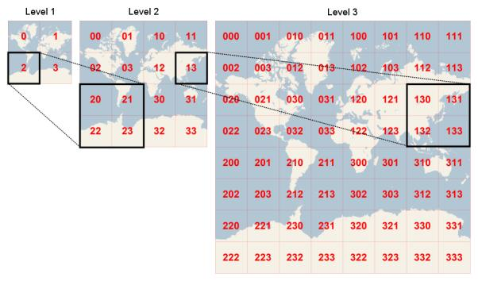
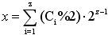

#   Bing Map

    
0    1

2    3

瓦片地址格式：http://r1.tiles.ditu.live.com/tiles/r132122232001311321.png?g=100&mkt=zh-cn

级数：[1-18] 

计算图片[为图片的code码，={0,1,2,3}]的像素（m,n）[注：像素坐标以左上角为原点，x轴向右，y轴向下]的经纬度

只需先计算出与x,y,z的关系，然后再套用openstreetmap的公式，就可以得到。

