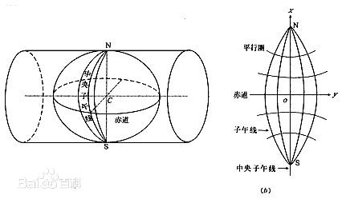

#  高斯-克吕格投影
该投影按照投影带中央子午线投影为直线且长度不变和赤道投影为直线的条件，确定函数的形式，从而得到高斯一克吕格投影公式。

投影后，除中央子午线和赤道为直线外，其他子午线均为对称于中央子午线的曲线。设想用一个椭圆柱横切于椭球面上投影带的中央子午线，

按上述投影条件，将中央子午线两侧一定经差范围内的椭球面正形投影于椭圆柱面。将椭圆柱面沿过南北极的母线剪开展平，即为高斯投影平面。取中央子午线与赤道交点的投影为原点，中央子午线的投影为纵坐标x轴，赤道的投影为横坐标y轴，构成高斯克吕格平面直角坐标系。

##  特性
- 等角投影——投影前后的角度相等，但长度和面积有变形。(无角度变形，图形保持相似)
- 等距投影——投影前后的长度相等，但角度和面积有变形。
- 等积投影——投影前后的面积相等，但角度和长度有变形。

##  特点
- 中央子午线无变形,离中央子午线越远，变形越大，在测量中，如果中央子午线输错了，投影的中央子午线就会编离实地坐标系正确的中央子午线，变形就越大，最终的结果就使用测量的误差更大。

##  分带投影
我国3度带共计22带（24～45带）。自1.5度子午线起每隔经差3度自西向东分带，带号依次编为三度带第1、2…120带。 
我国的经度范围西起73°东至135°，可分成六度带十一个，各带中央经线依次为75°、81°、87°、……、117°、123°、129°、135°，或三度带二十二个。

六度带可用于中小比例尺（如1：250000）测图，三度带可用于大比例尺（如1：10000）测图，城建坐标多采用三度带的高斯投影。

1. 高斯投影6度带：自0度子午线起每隔经差自西向东分带，依次编号1,2,3,…60。我国6度带中央子午线的经度，由75度起每隔6度而至135度,共计11带（13～23带），带号用n表示，中央子午线的经度用L表示，它们的关系是L=6n-3。

2. 高斯投影3度带：它的中央子午线一部分同6度带中央子午线重合，一部分同6度带的分界子午线重合，如用n表示3度带的带号，表示L带中央子午线经度，它们的关系L=3n。

##  自定义独立坐标系
一般来说，很多区域的高斯投影会有自己独立的坐标系
falseEasting(东伪偏移):一般为500000使得横坐标为正
falseNorthing(北伪偏移)：一般为0
centralMeridian(中央子午线)

