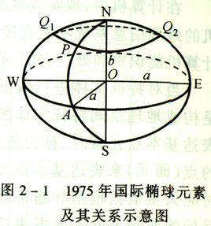

#  地理坐标系(GCS-球面坐标)
地图：用来描述以地球表面为基准面的地理信息。(特指平面地图)

然而，地球表面是极其复杂，不规则的。要描述这个基准面就需要将其抽象化、规则化建立空间模型。

因为地球近似一个椭球体，测绘时用椭球体逼近。地球椭球体的基本参数有长轴a(赤道半径)、短轴b(极半径)、扁率等。

椭球面和地球表面肯定不是完全贴合的，不同地区关注的位置不一样，为了更贴近自己所关注的区域，会使用不同的基准面。(地心基准面、区域基准面)

地球表面上一点，不同大地坐标系的坐标是不一样的，即经纬度是不一样的。

另外，国家规定必须至少采用GCJ-02对地理位置进行加密。所以国内谷歌地图和国外谷歌地图的坐标系是不一样的。

##  常用的地理坐标系
|地理坐标系       |EPSG Code|大地参照系     |参考椭球体     |长轴   |短轴         |扁率      |第一偏心率|第二偏心率|
|----------------|---------|--------------|--------------|-------|-------------|---------|--------|---------|
|GCS_WGS_1984    |4326     |              |              |6378137|6356752.3142|1:298.257|
|GCS_Beijing_1954|4214     |D_Beijing_1954|Krasovsky_1940|6378245|6356863.0188|1:298.3  |
|                |         |D_Xian_1980   |IAG75         |6378140|6356755.3   |1:298.257|
|                |         |D_China_2000  |CGCS2000      |6378245|6356863.0188|1:298.257|

