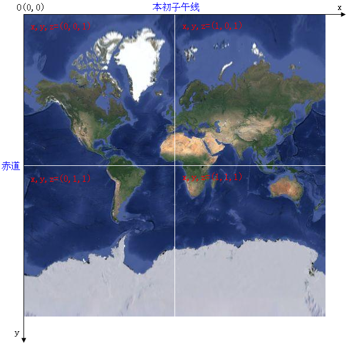

#   Google Map

    
(0,0,1)    (1,0,1)

(0,1,1)    (1,1,1)

瓦片地址格式：http://mt2.google.cn/vt/lyrs=m@167000000&hl=zh-CN&gl=cn&x=420&y=193&z=9 

z: [0-18]    x,y: [0-]

地图图层说明：

h skeleton map light  http://mt2.google.cn/vt/lyrs=h&hl=zh-CN&gl=cn&x=420&y=193&z=9

m 全地图   http://mt2.google.cn/vt/lyrs=m&hl=zh-CN&gl=cn&x=420&y=193&z=9

p terrain+map  http://mt2.google.cn/vt/lyrs=p&hl=zh-CN&gl=cn&x=420&y=193&z=9

r skeleton map dark   http://mt2.google.cn/vt/lyrs=r&hl=zh-CN&gl=cn&x=420&y=193&z=9

y hybrid satellite map   http://mt1.google.cn/vt/lyrs=y&hl=zh-CN&gl=cn&x=420&y=193&z=9

t 地形图   http://mt0.google.cn/vt/lyrs=t&hl=zh-CN&gl=cn&x=420&y=193&z=9

s 卫星地图   http://mt3.google.cn/vt/lyrs=s&hl=zh-CN&gl=cn&x=420&y=193&z=9

也可以进行组合，例如：s,r 或者 t,h   http://mt3.google.cn/vt/lyrs=t,h&hl=zh-CN&gl=cn&x=420&y=193&z=9

图片（x,y,z）像素（m,n）[注：像素坐标以左上角为原点，x轴向右，y轴向下]的经纬度[单位：度]与openmapstreet方法一致。
