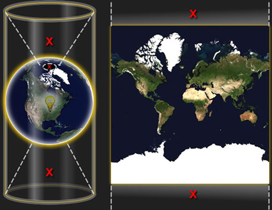

#  Web墨卡托投影(球形墨卡托投影)
圆形球体：以WGS84椭球的长半轴半径为球半径，即球半径取 6378137 米。(部门用的Flex地图端测距是6378000米，我认为是不太准确的)

投影坐标系：以赤道为标准纬线，本初子午线为中央经线，两者交点为坐标原点，向东向北为正，向西向南为负。

X轴：[-20 037 508.3427892,20 037 508.3427892]

y轴：[-20 037 508.3427892,20 037 508.3427892]

