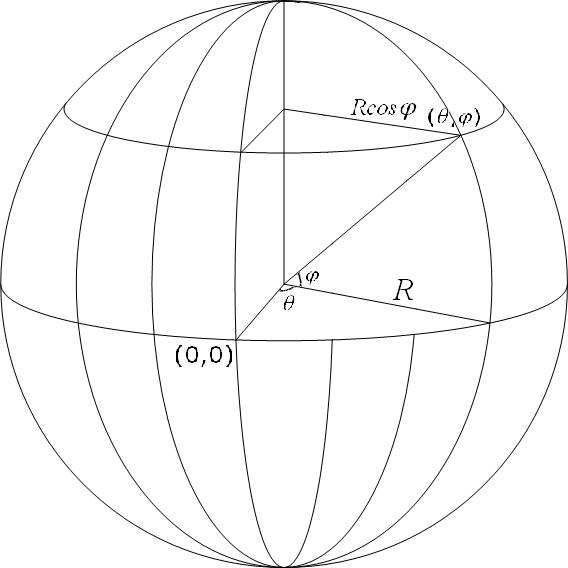

#  地理坐标系(球面坐标系)

地理坐标系(Geographic Coordinate Systems)使用三维球面来定义地球上的位置。

因为地球近似一个椭球体，测绘时用椭球体逼近。这就需要将其抽象化、规则化建立空间模型。

在球面系统中，水平线（或东西线）是等纬度线或纬线。垂直线（或南北线）是等经度线或经线。

椭球面和地球表面肯定不是完全贴合的，不同地区关注的位置不一样。

为了更贴近自己所关注的区域，会使用不同的基准面。(地心基准面、区域基准面)即地球表面上一点，不同大地坐标系的坐标是不一样的，即经纬度是不一样的。

另外，国家规定必须至少采用GCJ-02对地理位置进行加密。所以国内谷歌地图和国外谷歌地图的坐标系是不一样的。

##  [常用的地理坐标系](https://developers.arcgis.com/javascript/3/jshelp/gcs.html)
|地理坐标系       |EPSG Code|大地参照系     |参考椭球体     |长轴   |短轴         |扁率            |
|----------------|---------|--------------|--------------|-------|-------------|---------------|
|GCS_WGS_1984    |4326     |              |              |6378137|6356752.3142|1:298.257223563|
|GCS_Beijing_1954|4214     |D_Beijing_1954|Krasovsky_1940|6378245|6356863.0188|1:298.3        |
|GCS_Xian_1980   |4610     |D_Xian_1980   |IAG75         |6378140|6356755.3   |1:298.25722101 |
|GCS_China_Geodetic_Coordinate_System_2000|4490|D_China_2000|CGCS2000|6378245|6356863.0188|1:298.257|
|GCS_New_Beijing |4555     |D_New_Beijing |Krasovsky_1940|6378245|            |1:298.3        |

