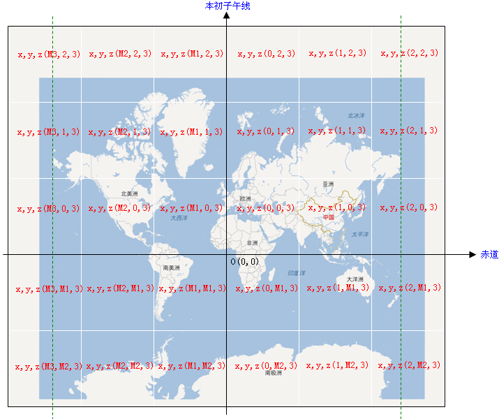
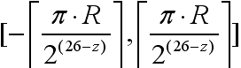
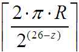
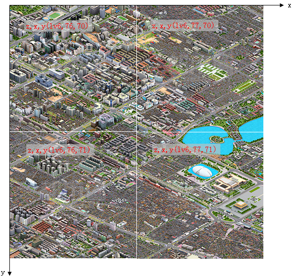
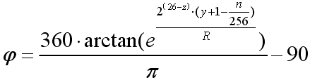
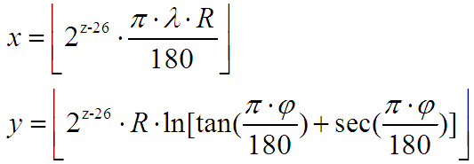

#   Baidu Map

    
瓦片地址格式：http://shangetu1.map.bdimg.com/it/u=x=99092;y=19997;z=19;v=017;type=web&fm=44&udt=20130712 

百度地图赤道上的分辨率为：

z: [3-19]    x,y:

注：其中R为地球半径（R=6378137）在第z级别，x,y方向的瓦片个数均为：

图层说明：

type=web 地图   http://shangetu0.map.bdimg.com/it/u=x=101237;y=37702;z=19;v=017;type=web&fm=44&udt=20130712

type=sate 卫星图  http://shangetu1.map.bdimg.com/it/u=x=101237;y=37702;z=19;v=009;type=sate&fm=46&udt=20130506

路网：http://online0.map.bdimg.com/tile/?qt=tile&x=101237&y=37702&z=19&styles=sl&v=017&udt=20130712

实时交通信息：http://its.map.baidu.com:8002/traffic/TrafficTileService?level=19&x=99052&y=20189&time=1373790856265&label=web2D&v=017

三维：http://d3.map.baidu.com/resource/mappic/bj/2/3/lv2/1251,1143.jpg?v=001  【z: [lv6-lv1]】

图片（x,y,z）像素（m,n）[注：像素坐标以左上角为原点，x轴向右，y轴向下]的经纬度[单位：度]分别为：

-----------------------------------------------------------------------------

已知经纬度(单位：度)，求瓦片编号x,y：

