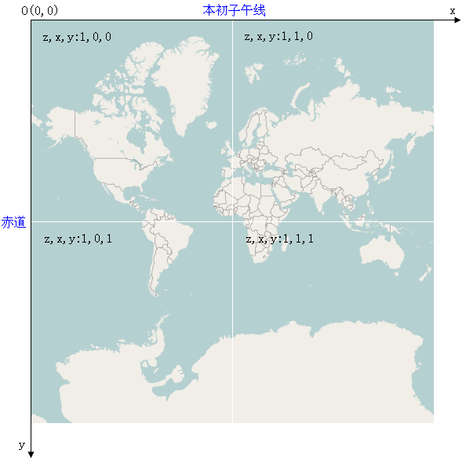
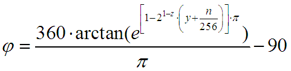
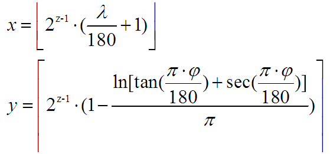

#   OpenStreetMap  
OpenStreetMap（简称OSM）是一个网上地图协作计划，目标是创造一个内容自由且能让所有人编辑的世界地图。

OSM的地图由用户根据手提GPS装置、航空摄影照片、其他自由内容甚至单靠地方智慧绘制。

瓦片地址格式：http://a.tile.openstreetmap.org/9/420/193.png

Cycle Map：http://c.tile.opencyclemap.org/cycle/9/420/193.png

Transport Map：http://b.tile2.opencyclemap.org/transport/9/420/193.png

MapQuest Map：http://otile3.mqcdn.com/tiles/1.0.0/osm/9/420/193.png

z: [0-18]    x,y: [0-2^z-1]

在第z级别，x,y方向的瓦片个数均为：

图片（z,x,y）像素（m,n）[注：像素坐标以左上角为原点，x轴向右，y轴向下]的经纬度[单位：度]分别为：

----------------------------------------------------------------------------

已知经纬度(单位：度)，求瓦片编号x,y：

