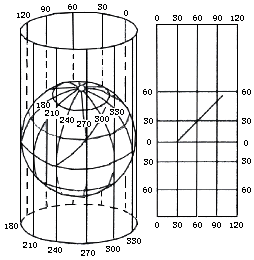

#   墨卡托投影
墨卡托(Mercator)投影，又名"等角正轴圆柱投影"

投影公式：

    x = λ - λ0 
    y = ln[tan(1/4π+1/2θ)] 
      = 1/2ln((1+sinθ)/(1-sinθ)) 
      = sinh^(-1)(tanθ) 
      = tanh^(-1)(sinθ) 
      = ln(tanθ+secθ)
逆运算：

    λ = x + λ0
    θ = 2tan^(-1)(e^y)-1/2π 
      = tan^(-1)(sinh y) 
      = gd(y) 

其中，λ为经度，θ为纬度。

## 特点
- 没有角度变形，由每一点向各方向的长度比相等，它的经纬线都是平行直线，且相交成直角，经线间隔相等，纬线间隔从基准纬线处向两极逐渐增大。
- 长度和面积变形明显，但基准纬线处无变形，从基准纬线处向两极变形逐渐增大，但因为它具有各个方向均等扩大的特性，保持了方向和相互位置关系的正确。

### 应用
在地图上保持方向和角度的正确是墨卡托投影的优点，墨卡托投影地图常用作航海图和航空图，如果循着墨卡托投影图上两点间的直线航行，方向不变可以一直到达目的地，因此它对船舰在航行中定位、确定航向都具有有利条件，给航海者带来很大方便。故广泛用于编制航海图和航空图等

### 支持墨卡托投影的在线地图：
- 谷歌地图
- 百度地图
- 天地图
- 高德地图
- 必应地图
- 腾讯地图

