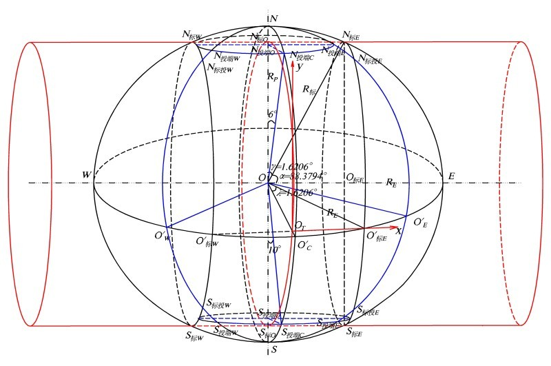

#   UTM投影
UTM投影为椭圆柱横正轴割地球椭球体，椭圆柱的中心线位于椭球体赤道面上，且通过椭球体质点。从而将椭球体上的点投影到椭圆柱上。两条割线圆在UTM投影图上长度无变，即2条标准经线圆。

两条割线圆之正中间为中央经线圆，中央经线投影后的长度为其投影前的0.9996倍，比例因子k=投影后的长度/投影前的实际长度。则标准割线和中央经线的经度差为1.620 6°，即1°37’14.244’’。

中央经线投影的比例因子k=0.999 6，即为中央经线圆（通过地球椭球体质点O、南北极N和S以及O’C的圆）圆周长的0.999 6倍为其同心圆（即弧段N标O--O’T--S标O，圆心为地球椭球体质点O，叫做中央标准圆，即图2中圆心为O点的红色圆）圆周长。这样N标O--O的长度（表示为N标OO，下同，略）=地球极半径RP（即NO）的0.999 6倍。N标OO=N标EO标E（O标E为线N标ES标E和线WE的交点），则

sin（α）=N标EO标E/ R标 = N标OO/R标=0.999 6′RP/R标

式中α为角N标E--O – E，即点N标E的纬度。R标为标准割线圆上（也在地球椭球体表面上）N标E的地球椭球体半径。

由于纬度很高，接近90°，故可做近似RP=R标，则

sin（α）= 0.999 6′RP/R标=0.999 6，则

α=88.379 4°

可以算出横正轴割椭圆柱与地球椭球体割线的纬度为88.379 4°N和88.379 4°S。

地球椭球体正轴割于椭圆柱于两个割线圆（即弧段N标E--O’标E--S标E所在的圆，圆心为O标E；以及弧段N标W--O’标W-- S标W所在的圆），穿过中央经线的红色圆（即弧段N标O--O’T--S标O，圆心为地球椭球体质点O）和这个两个割线圆等大且平行，椭圆柱的轴心线在地球椭球体赤道平面上，并通过地心质点。RE和RP分别为地球WGS 84椭球体的赤道和极半径。OT为UTM投影坐标的真原点。

这样，可以求出两个标准割圆和中央经线圆之间的距离N标ON标E为：

N标ON标E=R标′sin(90°-88.3794°)=RP′sin(90°-88.3794°)=179 776m。

式中，极半径RP=6356752.314245 m（根据WGS 84地球椭球体参数③）。

即标准割线圆在UTM投影上距离中央经线距离为179.776km。这样，陈悟天（2010）所说在UTM投影带中央经线两侧330km处各有一个标准经线是错误的。

每个UTM投影带为经度6°。对一个窄经度（如6°）带投影而言，Gauss-Krüger投影以其中央经线保持长度不变，而向中央经线两侧逐渐变形，明显不如UTM的保持中央经线缩短至0.9996，而出现2条长度不变的子午线的整个投影带上的长度变形上合理，改善了该6°带内长度投影变形分布。这也是UTM投影相比Gauss-Krüger投影的优势之一

由此，UTM投影除了中央经线投影后长度缩短0.0004，其两侧的两条割线的长度无变化外，和Gauss-Krüger投影条件基本一样

从赤道随着纬度的增加，收敛角（即真北和UTM投影北的夹角）越来越大。为保证投影的精度及大陆地区投影的一致性，UTM投影仅适用于纬度84°N和80°S的范围（这个范围覆盖了出南极洲外的几乎所有陆地）。

##  分带
UTM分带的起始经度为180°W，依次向东逐个累加。