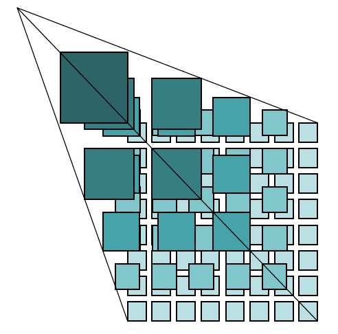

#   瓦片坐标系
瓦片坐标系(Tiles coordinate system)：为了优化地图系统性能，提高地图下载和显示速度，在Web方面通常需要对地图进行切片。

切片服务主要有：
- [TMS](./osgeo/tms.md)
- [WMTS](./ogc-standards/wmts.md)

TMS/WMTS使用瓦片矩阵集（Tile matrix set）来表示切割后的地图，瓦片就是包含地理数据的正方形/矩形影像，一幅地图按一定的瓦片大小被切割成多个瓦片，形成瓦片矩阵，一个或多个瓦片矩阵即组成瓦片矩阵集。不同的瓦片矩阵具有不同的分辨率，每个瓦片矩阵由瓦片矩阵标识符（一般为瓦片矩阵的序号，分辨率最低的一层为第0层，依次向上排）进行标识。

### 地图缩放级别的分辨率与地图比例尺的关系
Scale=Resolution×每米的像素个数，

以96dpi(即表示每英寸96像素，1英寸=2.54厘米)为例:

    Scale = Resolution×(96*100)/2.54
    Resolution = Scale*2.54/(96*100)
##  其他
开源与成熟商业的瓦片地图服务（TMS/WMTS），都有如下共同的特性，基本成为了标准：

(1) 坐标系：WGS84

(2) 投影：墨卡托投影（Marcator，正轴等角圆柱投影）

-------------------------------------------

注：均为弧度。

(3) 当经度范围在[-180,180]，投影为正方形时，纬度范围：[-85.05113, 85.05113]

(4) 图片大小：256*256

(5) 图片格式：jpg[有损压缩率高、不透明]   png[无损、透明]