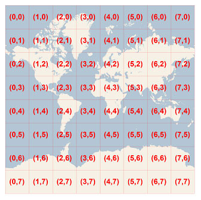
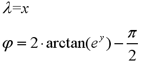
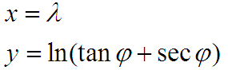

#   瓦片坐标系
瓦片坐标系(Tiles coordinate system)：为了优化地图系统性能，提高地图下载和显示速度，在Web方面通常需要对地图进行切片。

切片主要有：TMS、WMTS和WMS。

##  其他
开源与成熟商业的瓦片地图服务（TMS/WMTS），都有如下共同的特性，基本成为了标准：

(1) 坐标系：WGS84

(2) 投影：墨卡托投影（Marcator，正轴等角圆柱投影）

-------------------------------------------

注：均为弧度。

(3) 当经度范围在[-180,180]，投影为正方形时，纬度范围：[-85.05113, 85.05113]

(4) 图片大小：256*256

(5) 图片格式：jpg[有损压缩率高、不透明]   png[无损、透明]